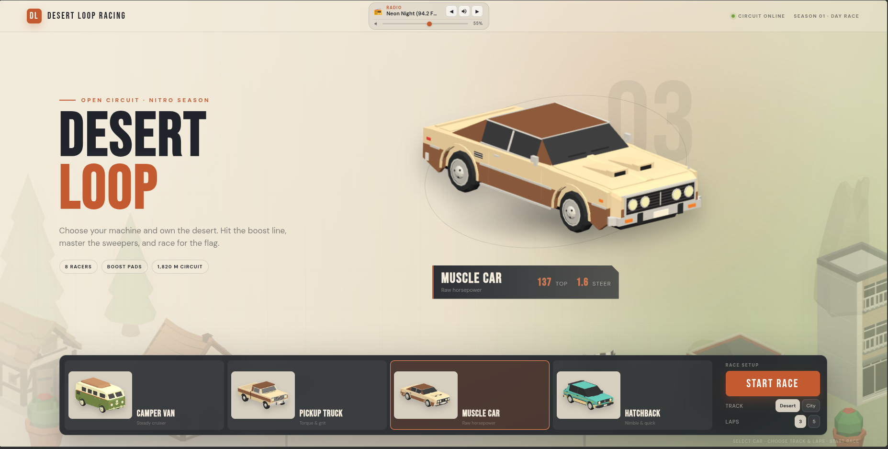
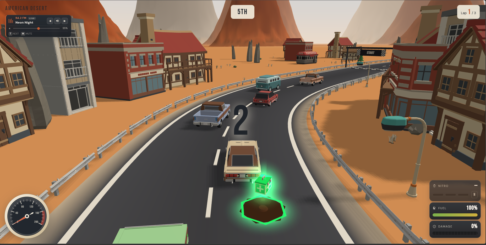
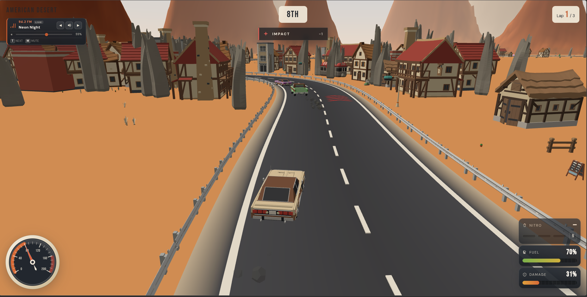

# Desert Loop

A browser racing game built with [Three.js](https://threejs.org/). Pick a car, tune the radio, and race AI around desert highways and oasis city streets — managing fuel, damage, and nitro along the way.

**Play:** [desert-loop.vercel.app](https://desert-loop.vercel.app)



## Screenshots

| Garage & race setup | Desert circuit racing | Collisions & damage |
| --- | --- | --- |
|  |  |  |
| Four driveable cars, Desert or City track, 3 or 5 laps, and a live radio equalizer | Chase the pack past diners and mesas; grab repair, fuel, and nitro pickups | Crashes dent the mesh, drain fuel, and cost positions — repair pads help you recover |

## Run locally

Serve the folder over HTTP (module imports need a real origin):

```bash
python3 -m http.server 8765
```

Open [http://localhost:8765](http://localhost:8765).

## Controls

| Key | Action |
| --- | --- |
| `W` / `↑` | Accelerate |
| `S` / `↓` / `Space` | Brake / handbrake / reverse |
| `A` / `←` · `D` / `→` | Steer |
| `N` | Use stored nitro |
| `T` / `]` / `[` | Next / previous radio station |
| `M` | Mute / unmute radio |
| Garage, Track & Radio UI | Choose car, track (Desert / City), lap count (3 or 5), and radio station |

## Tracks

### Desert (1,820 m)

The main circuit — a red-rock canyon highway with Saguaro cacti, sandstone monolith spires, Route 66 diners, ranch barns, and canyon chicanes. Eight AI racers fight for position on boost pads and sweepers.

### City (1,640 m)

An oasis valley circuit with buildings, high-speed sweepers, pine groves, and tighter urban corners.

## Features

- **Four driveable cars** — Camper Van, Pickup Truck, Muscle Car, and Hatchback, each with different top speed and steering
- **Desert Radio** — selectable stations from `sounds/radio/` (`Neon Night`, `Neon Velocity`, `Radio Off`), live animated equalizer, volume slider, and hotkeys; settings persist in `localStorage`
- **AI pack** — passing, blocking recovery, and lane changes across an 8-car field
- **Fuel & damage** — meters in the HUD; run dry or get totaled and the race ends
- **Pickups** — boost pads on the racing line, plus fuel, repair, and nitro scattered around the circuit
- **Nitro** — charges stored up to three; fire with `N`; pickups collect only on a real car touch
- **Speed streaks** and camera punch while boosting
- **Oil slicks** that make the car slip briefly
- **Procedural effects** — brake lights, exhaust smoke, and impact sparks

### Body damage

Impacts crumple the **car mesh itself** — not sticker overlays. Damage is directional:

- Front hits → bumper, hood, headlights
- Side hits → door panels
- Rear hits → bumper, trunk, brake lights

Severity stacks per panel. Repair pads ease panels back toward their pristine shape. Totaled cars get a short orbit camera around the wreck.

## Debug helpers

With the race running, open the browser console:

```js
__desertLoop.damagePlayer(35, 'front')  // 'front' | 'rear' | 'left' | 'right' | 'all'
__desertLoop.inspectPlayer(Math.PI / 2) // park camera around the player
```

## Stack

- Vanilla JS + Three.js `0.180` (CDN import map)
- GLB vehicle / building previews under `assets/`
- No build step — edit `game.js` / `index.html` and refresh
